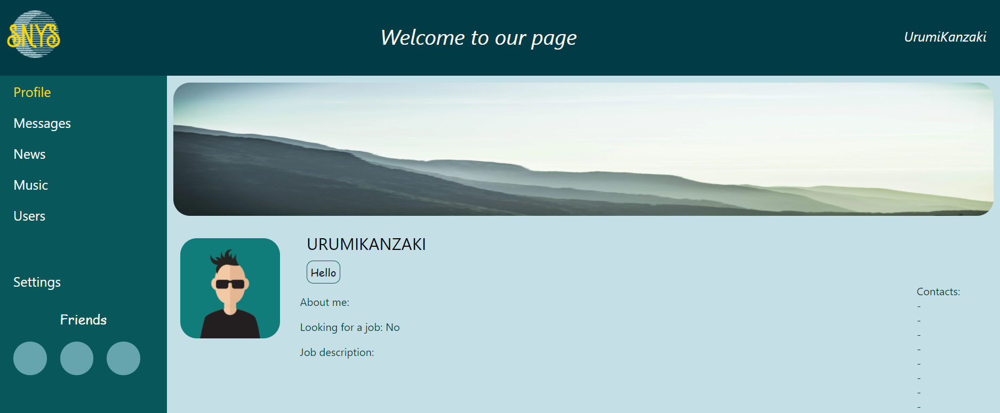

First React App - little social network in process

In the project directory, you can run:

### `npm start`
Runs the app in the development mode.\
Open [http://localhost:3000](http://localhost:3000) to view it in the browser.

API - [https://social-network.samuraijs.com/]() ### `Samurai API`
